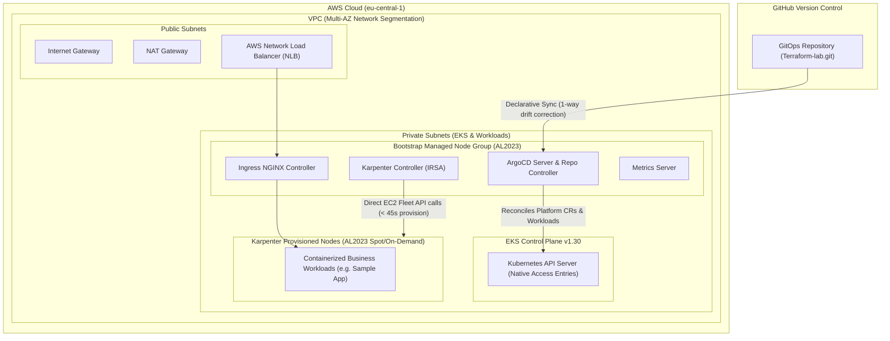

# Production-Grade, Cost-Optimized Kubernetes Platform on AWS (EKS & GitOps)

[](https://www.terraform.io/)
[](https://aws.amazon.com/eks/)
[](https://karpenter.sh/)
[](https://argo-cd.readthedocs.io/)
[](LICENSE)

Production-grade, cost-optimized multi-environment Kubernetes platform provisioned via **Terraform** and managed through **GitOps (ArgoCD)** on AWS. Engineered for high performance, lean operational overhead, and FinOps efficiency (strict network segmentation, IRSA least-privilege, native EKS Access Entries, sub-minute Karpenter Spot autoscaling with automatic node consolidation, and zero-touch lifecycle teardown).

---

## 🏛️ Architecture Overview



---

## 🌟 Key Architectural Pillars

### 1. High-Performance Autoscaling & FinOps (Karpenter v1)
- **Sub-Minute Scaling:** Replaces legacy Kubernetes Cluster Autoscaler with Karpenter v1, provisioning right-sized EC2 instances directly via `ec2:CreateFleet` in under 45 seconds.
- **Aggressive Cost Optimization:** Dynamically leverages **Spot** and **On-Demand** compute across modern instance families (`c`, `m`, `r`) on **Amazon Linux 2023 (AL2023)**.
- **Automated Consolidation:** Configured with `WhenEmpty` consolidation policy (30s timeout) to automatically drain and terminate underutilized nodes without manual intervention.

### 2. Pure GitOps Workflow (ArgoCD Platform & Workload Applications)
- **Zero Configuration Drift:** In-cluster state continuously reconciles against the Git repository (`master` branch) with `selfHeal` and automated sync enabled.
- **GitOps-Managed Karpenter Platform CRs:** Karpenter `NodePool` and `EC2NodeClass` resources are treated as declarative platform manifests within `gitops/platform/karpenter/` and orchestrated via an ArgoCD Application (`karpenter-resources`).
- **Accidental Deletion Shield:** Critical cluster infrastructure manifests use `prune: false` within GitOps to prevent catastrophic node teardown from accidental Git commits.

### 3. Cloud Security, Identity & Access Control
- **Native EKS Access Entries (EKS 1.30):** Operates with `authentication_mode = "API_AND_CONFIG_MAP"`, eliminating reliance on the legacy `aws-auth` ConfigMap for node join. Karpenter dynamically-provisioned nodes authenticate natively using an AWS-native `aws_eks_access_entry` resource (`type = "EC2_LINUX"`), while system nodes are managed natively by AWS EKS Managed Node Groups.
- **IAM Roles for Service Accounts (IRSA):** OIDC-federated role bindings ensure the Karpenter controller only possesses least-privilege IAM permissions without hardcoded secrets or static node-level rights.
- **Security Group Isolation:** Karpenter nodes inherit the EKS Primary Cluster Security Group via discovery tags (`karpenter.sh/discovery`), guaranteeing secure intra-cluster (kubelet port 10250) and control-plane communication without exposing ports to the public internet.

### 4. Deterministic Lifecycle & Clean Teardown
- **Zero-Orphan Terraform Teardown:** Solves standard Terraform DAG limitations through explicit dependency binding:
  - Reverse dependency chaining (`modules/vpc/outputs.tf`) prevents NAT Gateway and Route Table associations from destroying before in-cluster pods and controllers finish API-level deregistration.
  - Cascade finalizer management (`resources-finalizer.argocd.argoproj.io`) ensures Karpenter platform resources and Kubernetes objects cleanly delete before Helm releases uninstall.
  - Embedded `terraform_data` pre-destroy provisioner coordinates Karpenter CR termination, instance profile cleanup, and finalizer release within a single `terraform destroy -auto-approve` execution.

---

## 📂 Repository Structure

```text
.
├── bootstrap/                      # Remote State Storage Bootstrapping
│   ├── main.tf                     # S3 State Bucket (versioning, AES256, public access block)
│   ├── variables.tf                # Region & bucket naming variables
│   └── outputs.tf                  # S3 state bucket name identifier
│
├── environments/
│   ├── dev/                        # Development Environment
│   │   ├── backend.tf              # S3 Remote Backend with S3 Native State Locking (use_lockfile = true)
│   │   ├── main.tf                 # Dev Root Composition (2 AZs, dev-k8s-cluster)
│   │   ├── variables.tf            # Environment variable definitions
│   │   ├── terraform.tfvars        # Environment variable values
│   │   └── outputs.tf              # Cluster endpoint & identifiers
│   └── prod/                       # Production Environment
│       ├── backend.tf              # S3 Remote Backend with S3 Native State Locking (use_lockfile = true)
│       ├── main.tf                 # Prod Root Composition (3 AZs, prod-k8s-cluster)
│       ├── variables.tf            # Environment variable definitions
│       ├── terraform.tfvars        # Environment variable values
│       └── outputs.tf              # Cluster endpoint & identifiers
│
├── modules/
│   ├── vpc/                        # Multi-AZ VPC module with public/private subnets
│   │   ├── main.tf                 # IGW, NAT Gateway, Route Tables, Karpenter discovery tags
│   │   ├── variables.tf            # VPC CIDRs & subnet configuration
│   │   ├── providers.tf            # AWS provider requirements
│   │   └── outputs.tf              # Protected subnet outputs with explicit destroy-order depends_on
│   │
│   ├── k8s-cluster/                # Core EKS & IAM Platform
│   │   ├── main.tf                 # EKS Control Plane (1.30), Access Entries, Managed Node Group (AL2023)
│   │   ├── iam.tf                  # OIDC Provider, IRSA roles, Karpenter Controller & Node policies
│   │   ├── variables.tf            # Cluster configuration variables
│   │   └── outputs.tf              # IAM Role ARNs & Cluster Connection Details
│   │
│   └── k8s-addons/                 # Platform Add-ons & GitOps Bootstrapping
│       ├── main.tf                 # Helm releases (Metrics Server, Ingress NGINX, ArgoCD, Karpenter)
│       ├── argocd_apps.tf          # ArgoCD Application for sample-app workload
│       ├── karpenter_resources.tf  # Karpenter ArgoCD App + Graceful Destroy Provisioner
│       └── variables.tf            # Add-on configuration & GitOps repo URL
│
├── gitops/                         # Declarative GitOps Manifests (ArgoCD target)
│   ├── root-application.yaml       # Standalone ArgoCD Application manifest template
│   ├── apps/
│   │   └── sample-app/             # Business workload (nginxdemos/hello:plain-text)
│   │       ├── deployment.yaml     # Application deployment with resource requests/limits
│   │       ├── service.yaml        # ClusterIP service definition
│   │       └── kustomization.yaml  # Kustomize resource bundle
│   └── platform/
│       └── karpenter/              # Karpenter custom resources (Kustomization)
│           ├── ec2nodeclass.yaml   # AWS AL2023 AMI terms, Subnet & SG discovery tags
│           ├── nodepool.yaml       # Spot/On-Demand instance categories (c, m, r) & consolidation rules
│           └── kustomization.yaml  # Kustomize manifest bundle
│
└── tests/                          # Automated Infrastructure Testing (Terratest)
    ├── vpc_test.go                 # Terratest automated Go test suite for VPC module
    ├── go.mod                      # Go module dependencies
    └── go.sum                      # Go checksums
```

---

## ⚙️ Environment Specifications

| Component | Dev (`environments/dev`) | Prod (`environments/prod`) |
| :--- | :--- | :--- |
| **AWS Region** | `eu-central-1` (Frankfurt) | `eu-central-1` (Frankfurt) |
| **VPC CIDR** | `10.100.0.0/16` | `10.200.0.0/16` |
| **Availability Zones** | 2 AZs (`eu-central-1a`, `eu-central-1b`) | 3 AZs (`eu-central-1a`, `eu-central-1b`, `eu-central-1c`) |
| **EKS Version** | `1.30` | `1.30` |
| **Authentication Mode** | `API_AND_CONFIG_MAP` (Native Access Entries) | `API_AND_CONFIG_MAP` (Native Access Entries) |
| **Bootstrap Node Group**| 2x `t3.medium` across 2 AZs (On-Demand, AL2023) | 2x `t3.medium` across 3 AZs (On-Demand, AL2023) |
| **Dynamic Autoscaling** | Karpenter v1 (AL2023 Spot & On-Demand) | Karpenter v1 (AL2023 Spot & On-Demand) |
| **State Management** | S3 Remote State + S3 Native State Locking | S3 Remote State + S3 Native State Locking |

---

## 🚀 Deployment & Operations

### Prerequisites
- [AWS CLI v2](https://docs.aws.amazon.com/cli/latest/userguide/install-cliv2.html) configured with administrative privileges
- [Terraform >= 1.10.0](https://www.terraform.io/downloads.html) (tested on `v1.16.0`; `>= 1.10.0` required for S3 native `use_lockfile = true`)
- [kubectl >= 1.30](https://kubernetes.io/docs/tasks/tools/)
- [Go >= 1.26](https://golang.org/) (optional, for Terratest)

### 0. Bootstrap Remote State Storage (Initial Setup)
Before deploying environments for the first time, initialize and provision the S3 state bucket:
```bash
# Navigate to bootstrap module
cd bootstrap

# Initialize and apply
terraform init
terraform apply -auto-approve

cd ..
```

### 1. Provision Infrastructure
```bash
# Navigate to desired environment
cd environments/dev

# Initialize providers and remote backend
terraform init

# Validate configuration
terraform validate

# Provision full platform (EKS, VPC, Karpenter, ArgoCD)
terraform apply -auto-approve
```

### 2. Configure Local Kubernetes Access
```bash
aws eks update-kubeconfig --region eu-central-1 --name dev-k8s-cluster

# Verify system components
kubectl get nodes -o wide
kubectl get applications -n argocd
kubectl get nodepool,ec2nodeclass
```

### 3. Verify Autoscaling in Action
Simulate workload demand to observe Karpenter spinning up a dynamic Spot instance in ~35 seconds:
```bash
# Deploy a test workload requiring 1 CPU
kubectl create deployment karpenter-test --image=registry.k8s.io/pause:3.2 --replicas=3
kubectl set resources deployment karpenter-test --requests=cpu=1,memory=512Mi

# Watch Karpenter create a NodeClaim and join an EC2 Spot node
kubectl get nodeclaims -w

# Delete workload and observe automated consolidation (scale-down after 30s)
kubectl delete deployment karpenter-test
kubectl get nodes -w
```

### 4. Automated Testing (Terratest)
Validate module functionality using the automated test suite:
```bash
cd tests
go test -v -timeout 30m
```

### 5. Clean Platform Teardown
A single automated command cleanly dismantles the entire infrastructure without orphaned AWS load balancers, dangling ENIs, or stuck finalizers:
```bash
# From environments/dev or environments/prod
terraform destroy -auto-approve
```

---

## 🛡️ Engineering Best Practices & Operational Excellence

- ✅ **Immutable Infrastructure as Code & Deterministic Versioning:** Pinned AWS provider (`aws = "= 6.64.0"`), exact provider versions locked via `.terraform.lock.hcl` (`aws 6.64.0`, `helm 2.12.1`, `kubernetes 3.3.0`, `kubectl 1.19.0`), and strictly pinned Helm chart releases (`karpenter 1.0.1`, `metrics-server 3.12.1`, `ingress-nginx 4.10.0`, `argo-cd 6.7.11`).
- ✅ **State Locking:** Utilizes S3 native state locking (`use_lockfile = true`) for concurrent execution safety without requiring additional DynamoDB overhead.
- ✅ **Self-Healing Platform:** ArgoCD continuously monitors for configuration drift and automatically reverts unauthorized manual cluster edits (`selfHeal = true`).
- ✅ **Graceful Node Decommissioning:** Karpenter node disruption leverages automated drain and cordoning protocols to guarantee zero workload interruption during node consolidation (`WhenEmpty`, 30s consolidation delay).
- ✅ **Automated Infrastructure Testing:** Includes Terratest integration test suite (`tests/vpc_test.go`) validating VPC isolation and subnet provisioning.

---

## 👤 Author
**Ferenc Zágon**  
DevOps / Cloud Platform Engineer  
GitHub: [@ferenc-zagon](https://github.com/ferenc-zagon)